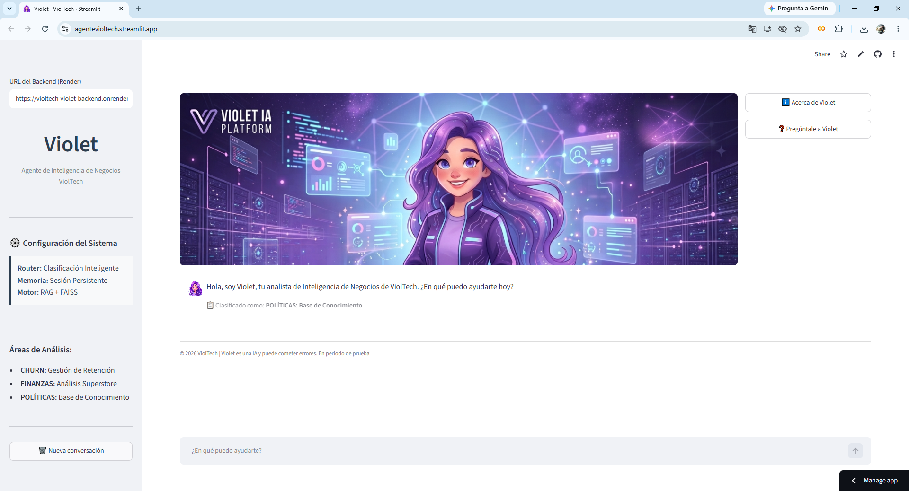
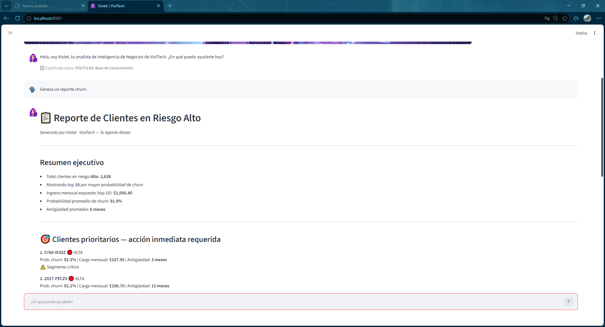
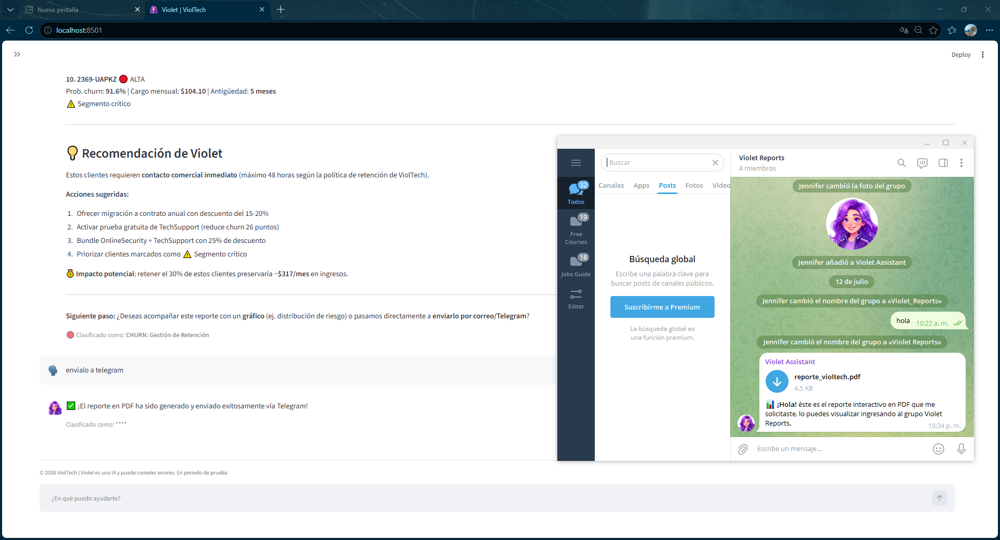
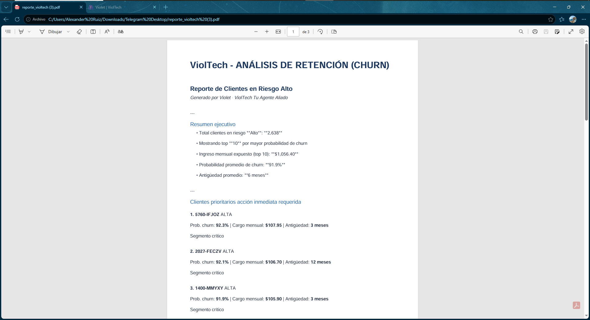

# 🟣 Violet | ViolTech — Agente IA de Análisis de Datos

**Violet** es un agente de inteligencia artificial conversacional desarrollado para **ViolTech**, capaz de analizar datos de negocio en tiempo real, consultar documentación corporativa y entregar reportes ejecutivos directamente por Gmail o Telegram — todo a través de una conversación en lenguaje natural.

Proyecto desarrollado como parte del **Challenge de Alura Latam — Programa ONE (Oracle Next Education), Fase 2**.

---

## ✨ ¿Qué puede hacer Violet?

| Capacidad | Descripción |
|---|---|
| 📉 **Análisis de Churn** | Identifica clientes con riesgo de abandono, genera reportes de retención con recomendaciones de acción priorizadas por segmento crítico. |
| 💰 **Análisis Financiero** | Analiza el dataset de ventas (Superstore): rentabilidad por categoría, márgenes, descuentos y puntos de pérdida. |
| 🛡️ **Consulta de Políticas** | Responde preguntas sobre manuales y políticas internas de la empresa usando RAG (Retrieval-Augmented Generation) sobre documentos PDF. |
| 📊 **Gráficos dinámicos** | Genera visualizaciones de datos bajo demanda, adaptadas a la pregunta del usuario. |
| 📧 **Envío de reportes** | Exporta cualquier reporte a PDF y lo envía directamente por **Gmail** o **Telegram**, sin salir del chat. |
| 🧠 **Memoria conversacional** | Mantiene el contexto de la conversación para interpretar respuestas de seguimiento ("sí", "envíalo", "el segundo gráfico"). |

---

## 🏗️ Arquitectura

Violet está construida como un sistema de dos capas desacopladas, comunicadas vía API REST — pensado para desplegarse con el frontend y el backend en servidores distintos.

```
┌─────────────────────┐         HTTPS          ┌──────────────────────────┐
│   Streamlit App      │  ───────────────────▶  │   FastAPI Backend         │
│   (Frontend / Chat)  │  ◀───────────────────  │   (Render)                │
└─────────────────────┘      JSON / REST        └──────────┬───────────────┘
                                                              │
                              ┌───────────────────────────────┼───────────────────────────────┐
                              │                                │                                │
                    ┌─────────▼─────────┐          ┌───────────▼───────────┐        ┌───────────▼───────────┐
                    │  Router de         │          │  Agente ReAct          │        │  Vector Store (FAISS)  │
                    │  Clasificación      │          │  (LangChain + Cohere)  │        │  + BM25 Híbrido         │
                    │  CHURN/FINANZAS/    │          │  Herramientas de       │        │  sobre políticas PDF    │
                    │  POLITICAS/ENVIO    │          │  reporte y gráficos    │        │                         │
                    └────────────────────┘          └────────────┬───────────┘        └─────────────────────────┘
                                                                    │
                                                      ┌─────────────┴─────────────┐
                                                      │                            │
                                              ┌───────▼───────┐          ┌─────────▼─────────┐
                                              │  Gmail (SMTP)  │          │  Telegram Bot API   │
                                              └────────────────┘          └────────────────────┘
```

**Flujo típico:** el usuario escribe una pregunta en el chat de Streamlit → el backend clasifica la intención (churn, finanzas, políticas o envío) → según el caso, invoca al agente de LangChain (que decide qué herramienta usar) o consulta directamente el índice vectorial de documentos → la respuesta se muestra en pantalla y, si el usuario lo solicita, se exporta a PDF y se envía por el canal elegido.

---

## 🛠️ Stack Tecnológico

- **Frontend:** [Streamlit](https://streamlit.io)
- **Backend:** [FastAPI](https://fastapi.tiangolo.com) (API asíncrona, desplegado en Render)
- **Orquestación de agentes:** [LangChain](https://www.langchain.com) (patrón ReAct)
- **Modelo de lenguaje:** [Cohere](https://cohere.com) (`command-r-plus`)
- **Búsqueda semántica:** FAISS + BM25 (recuperador híbrido) sobre embeddings multilingües de Cohere
- **Generación de PDF:** [ReportLab](https://www.reportlab.com)
- **Análisis de datos:** Pandas
- **Visualización:** Matplotlib / Seaborn
- **Envío de reportes:** SMTP (Gmail) y Telegram Bot API

---

## 📁 Estructura del Proyecto

```
agente_violtech/
├── app/
│   ├── config.py         # Rutas, variables de entorno y carga de datasets
│   ├── router.py         # Clasificador de intención (CHURN/FINANZAS/POLITICAS/ENVIO)
│   ├── embeddings.py      # Carga del índice vectorial híbrido (FAISS + BM25)
│   ├── herramientas.py    # Herramientas del agente: reportes, gráficos, envío
│   ├── agente.py          # Construcción del agente ReAct + memoria conversacional
│   ├── prompts.py         # Prompt maestro de Violet (personalidad y reglas)
│   ├── envio.py            # Generación de PDF y envío por Gmail/Telegram
│   └── backend.py          # Orquestador principal (router central de la API)
├── datos/
│   ├── clientes_scored.csv           # Dataset de Churn (TelcoVenezuela)
│   ├── Sample-Superstore_cleaned.csv # Dataset financiero (Superstore Retail)
│   ├── docs/                          # Documentos PDF para consulta (RAG)
│   └── faiss_index/                   # Índice vectorial pre-construido
├── imagen/                # Recursos gráficos de la interfaz
├── main.py                # Punto de entrada de la API (FastAPI)
├── streamlit_app.py        # Punto de entrada del frontend (Streamlit)
├── requirements.txt         # Dependencias del entorno local
├── requirements_render.txt  # Dependencias del entorno de despliegue (Render)
└── .env                     # Variables de entorno (no versionado)
```

---

## 🚀 Instalación y ejecución local

### 1. Clonar el repositorio

```bash
git clone https://github.com/jenniferlsu20/agente_violtech.git
cd agente_violtech
```

### 2. Crear entorno virtual e instalar dependencias

```bash
python -m venv .venv-violet
.venv-violet\Scripts\activate   # Windows
source .venv-violet/bin/activate  # Linux / macOS

pip install -r requirements.txt
```

### 3. Configurar variables de entorno

Crea un archivo `.env` en la raíz del proyecto con las siguientes claves:

```dotenv
# Cohere
COHERE_API_KEY=tu_api_key_de_cohere

# Gmail (SMTP)
SMTP_USER=tu_correo@gmail.com
SMTP_APP_PASSWORD=tu_contraseña_de_aplicación
SMTP_SERVER=smtp.gmail.com
SMTP_PORT=465

# Telegram
TELEGRAM_BOT_TOKEN=tu_token_del_bot
TELEGRAM_CHAT_ID=id_del_grupo_o_chat
```

> 💡 El `TELEGRAM_CHAT_ID` de un grupo siempre es un número **negativo** (ej. `-1001234567890`). Asegúrate de que el bot esté agregado como miembro del grupo antes de enviar reportes.

### 4. Levantar el backend (FastAPI)

```bash
uvicorn main:app --reload
```
La API queda disponible en `http://127.0.0.1:8000`.

### 5. Levantar el frontend (Streamlit)

En otra terminal:
```bash
streamlit run streamlit_app.py
```
La interfaz de chat queda disponible en `http://localhost:8501`. Ingresa la URL del backend en la barra lateral (por defecto, `http://127.0.0.1:8000`).

---

## ☁️ Despliegue

- **Backend:** desplegado en [Render](https://render.com) mediante `requirements_render.txt`.
- **Frontend:** puede desplegarse en [Hugging Face Spaces](https://huggingface.co/spaces) o cualquier servicio compatible con Streamlit, apuntando la URL del backend a la instancia de Render.

> ⚠️ Recuerda configurar las mismas variables de entorno del paso 3 en el panel de tu servicio de despliegue — el archivo `.env` local **no** se sube al repositorio (está excluido en `.gitignore`) y debe configurarse manualmente en producción.

---

## 💬 Vista previa

<p align="center">
  
  
</p>
<p align="center">
  
  
</p>

---

## 👩‍💻 Autoría

Desarrollado por **Jennifer** como proyecto final del **Challenge Alura Latam ONE — Fase 2**.

---

## 📄 Licencia

Este proyecto se distribuye con fines educativos, como parte del programa Oracle Next Education (ONE) de Alura Latam.
